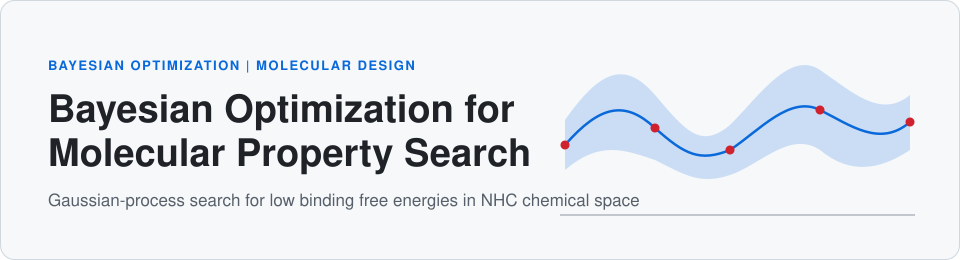
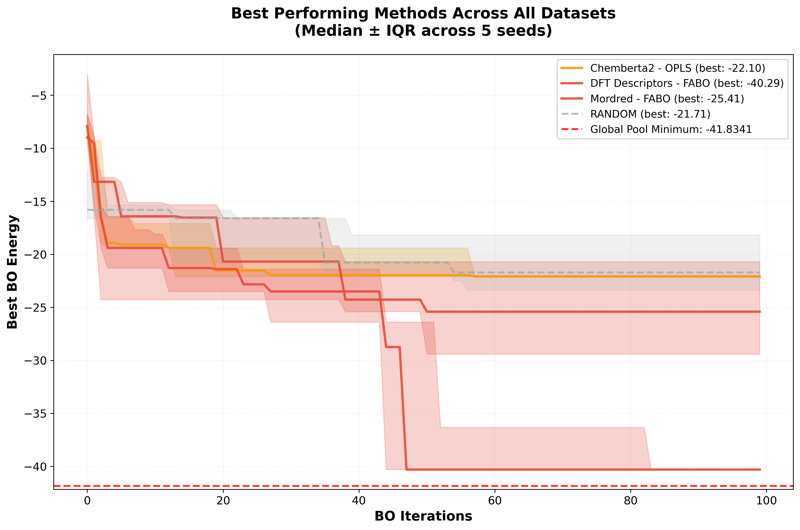
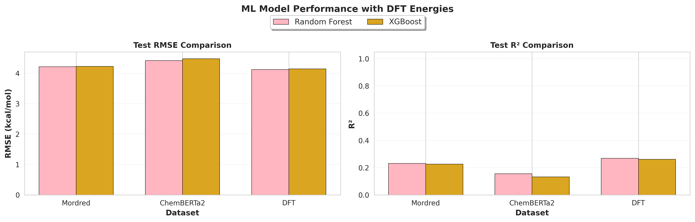

<p align="center">
  
</p>

<p align="center">
  
  
  
  
</p>

# Bayesian Optimization for N-heterocyclic carbene (NHC) design

Search a pool of ~6,850 candidate molecules for the one with the lowest DFT binding free energy, while evaluating as few molecules as possible.

## Why this matters

Computing a binding free energy for one molecule is expensive (DFT or xTB). Screening a whole library is rarely affordable. Bayesian optimization (BO) fits a cheap probabilistic surrogate to the energies seen so far and uses it to choose the next molecule to evaluate. The open question this project explores is how the **molecular representation** (hundreds to thousands of features) and **dimensionality reduction / feature selection** affect that search.

## Method overview

Each run starts from 10 random molecules, then performs 100 BO iterations on a pool with a 5% held-out test set (`config/default_config.yaml`). Energies are **minimised**.

| Component | Implemented options | Where |
|---|---|---|
| Surrogate | Exact GP (BoTorch `SingleTaskGP`) with ARD kernel: Matern (nu=2.5), RBF, Rational Quadratic | `src/gp_model.py`, `src/kernels/` |
| Acquisition | EI (log-EI), PI, UCB; q-EI / q-UCB for batches | `src/acquisition/`, `src/acquisition.py` |
| Feature handling | `vanilla` (none), `fabo` (Spearman correlation + CV), `pca`, `pls`, `opls` | `src/feature_selection/`, `src/pipelines/` |
| Baseline | Random search | `baselines/random_search.py` |
| Supervised baselines | Random Forest, XGBoost (sanity check on how learnable the target is) | `ml_models.train_models` via `train_all_ml_models.sh` (see note below) |

The reported experiments use **Matern + EI**, 4 feature methods (FABO, OPLS, PCA, PLS) and 5 seeds (42-46). The `vanilla` mode is implemented but has no results in this repository (it needs a lot of memory on the full descriptor sets).

## Datasets and representations

All files are in `data/`. The `*.csv` feature files are stored with Git LFS.

| Target | File | Notes |
|---|---|---|
| DFT binding free energy | `dft_G.json` | 6,850 molecules (SMILES + energy), minimum -41.8341 |
| xTB binding free energy | `xtb_G.json` | 9,996 molecules (SMILES + energy), minimum about -41.14 |

| Representation | DFT file | xTB file |
|---|---|---|
| DFT-derived descriptors | `dft_descriptors.csv` | n/a |
| ChemBERTa-2 embeddings | `dft_chemberta2.csv` | `xtb_chemberta2.csv` |
| Mordred descriptors | `dft_mordred.csv` | `xtb_mordred.csv` |

All BO runs and ML baselines in this repository use the **DFT** target. xTB data is included, but no xTB results are.

## Results

All numbers below are computed from the CSVs in `results/` and `ml_plots/` by [`scripts/summarize_results.py`](scripts/summarize_results.py).

### BO vs random search (DFT target, 100 iterations, 5 seeds)

Best energy found (lower is better; pool optimum = -41.8341) and the first iteration at which it was reached. Mean ± std (sample std) across 5 seeds.

| Representation | Method | Best energy | Iteration reached | Seeds at pool optimum |
|---|---|---|---|---|
| DFT descriptors | FABO | **-39.81 ± 2.06** | 47.8 ± 26.7 | 1/5 |
| DFT descriptors | OPLS | -21.89 ± 1.79 | 48.8 ± 20.2 | 0/5 |
| DFT descriptors | PCA | -34.37 ± 9.28 | 48.2 ± 19.2 | 1/5 |
| DFT descriptors | PLS | -29.18 ± 11.56 | 36.8 ± 23.1 | 2/5 |
| ChemBERTa-2 | FABO | -22.65 ± 2.60 | 67.0 ± 33.2 | 0/5 |
| ChemBERTa-2 | OPLS | -22.43 ± 1.31 | 48.6 ± 26.9 | 0/5 |
| ChemBERTa-2 | PCA | -22.58 ± 1.36 | 53.6 ± 41.2 | 0/5 |
| ChemBERTa-2 | PLS | -22.51 ± 1.26 | 61.4 ± 31.0 | 0/5 |
| ChemBERTa-2 | Random | -24.21 ± 9.31 | 44.0 ± 22.3 | 0/5 |
| Mordred | FABO | -26.10 ± 7.07 | 32.2 ± 20.0 | 0/5 |
| Mordred | OPLS | -22.08 ± 0.88 | 61.8 ± 30.2 | 0/5 |
| Mordred | PCA | -25.15 ± 8.46 | 56.2 ± 20.7 | 0/5 |
| Mordred | PLS | -21.22 ± 0.96 | 43.4 ± 33.2 | 0/5 |
| Mordred | Random | -24.21 ± 9.31 | 44.0 ± 22.3 | 0/5 |

Notes on the table:
- Random search does not depend on the feature set, and the repository contains identical random-search histories for the ChemBERTa-2 and Mordred folders. There is no random-search run for the DFT-descriptor set, so none is reported there.
- The plots below show **median ± IQR**, so their legend values differ from the means in the table.

<p align="center">
  
</p>

Per-representation comparisons of all methods: [`comparison_dft_descriptors.png`](plots/comprehensive_comparison/comparison_dft_descriptors.png), [`comparison_dft_chemberta2.png`](plots/comprehensive_comparison/comparison_dft_chemberta2.png), [`comparison_dft_mordred.png`](plots/comprehensive_comparison/comparison_dft_mordred.png). GP hyperparameter diagnostics (12 plots) are in [`plots/gp_diagnostics/`](plots/gp_diagnostics/).

### Supervised baselines: how learnable is the target?

Random Forest and XGBoost trained on the full dataset (`ml_plots/ml_model_summary.csv`):

| Representation | Model | Test RMSE | Test R² |
|---|---|---|---|
| DFT descriptors | Random Forest | 4.1 | 0.269 |
| DFT descriptors | XGBoost | 4.1 | 0.262 |
| Mordred | Random Forest | 4.2 | 0.232 |
| Mordred | XGBoost | 4.2 | 0.227 |
| ChemBERTa-2 | Random Forest | 4.4 | 0.156 |
| ChemBERTa-2 | XGBoost | 4.5 | 0.132 |

<p align="center">
  
</p>

Predicted-vs-actual plot: [`ml_plots/ml_predictions_vs_actual.png`](ml_plots/ml_predictions_vs_actual.png).

### Key takeaways

- **DFT descriptors + FABO was the only clear win:** -39.81 ± 2.06 vs -24.21 ± 9.31 for random search (ChemBERTa-2/Mordred folders), and the pool optimum (-41.8341) was found in 1 of 5 seeds.
- **On ChemBERTa-2 and Mordred, no BO variant is distinguishable from random search.** Means range from -21.22 to -26.10, all within the random-search spread (std 9.31).
- **Results are seed-sensitive.** With only 5 seeds, several methods have std above 7 (e.g. PLS on descriptors ±11.56), so rankings among them should not be over-read.
- **The method matters most on the small descriptor set:** FABO (-39.81) and PCA (-34.37) are far ahead of OPLS (-21.89) there; on the larger representations the methods differ little.
- **The target is hard to learn** (test R² 0.13-0.27 for RF/XGBoost), and the representation with the highest R² (DFT descriptors) is also where BO worked best. This is consistent with, but does not prove, a link between predictability and BO success.

## Repository structure

```
.
├── assets/hero.svg              # README banner
├── baselines/random_search.py   # random-search baseline
├── config/default_config.yaml   # default BO / feature-selection / ML settings
├── data/                        # DFT and xTB targets + feature CSVs (LFS)
├── src/
│   ├── cli.py                   # entry point (bo-optimize / python -m src.cli)
│   ├── gp_model.py, kernels/    # GP surrogate and kernels
│   ├── acquisition/             # acquisition functions
│   ├── feature_selection/       # FABO, PCA, PLS, OPLS, vanilla
│   └── pipelines/               # one BO pipeline per method
├── plotting/                    # plot scripts
├── scripts/                     # summarize_results.py, cache sync/verify helpers
├── results/                     # BO + random-search histories (CSV)
├── ml_results/, ml_plots/       # supervised baseline outputs
├── plots/                       # BO comparison and GP diagnostic figures
├── run_all_dft_experiments.sh   # all 75 local runs
├── submit_all_experiments.sh    # SLURM array job (HPC)
└── train_all_ml_models.sh       # RF / XGBoost baselines
```

## Installation

```bash
git clone https://github.com/0rkhann/BO_project.git
cd BO_project
git lfs pull                      # feature CSVs are stored with Git LFS
python -m venv .bo_project_env
source .bo_project_env/bin/activate
pip install -r requirements.txt
```

## Quick start

Single run through the CLI (`src/cli.py`):

```bash
python -m src.cli --mode fabo \
  --input data/dft_descriptors.csv --cache data/dft_G.json \
  --output-dir results/dft_descriptors/fabo_Matern_EI/seed42 \
  --n-initial 10 --n-iter 100 --seed 42 \
  --kernels Matern --acquisitions EI
```

`--mode` is one of `vanilla`, `fabo`, `pca`, `pls`, `opls`, `random`. The package also installs a `bo-optimize` command via `setup.py`.

| Script | What it does | Where to run |
|---|---|---|
| `run_all_dft_experiments.sh` | 60 BO runs (3 representations x 4 methods x 5 seeds) + 15 random-search runs, Matern + EI | Local, but long; a cluster is recommended |
| `submit_all_experiments.sh` | SLURM array job (`--array=0-59`, 24 h, 16 GB, 4 CPUs per task); a broader sweep including `vanilla`, 2 kernels, 2 acquisitions, 1 seed | **HPC cluster** (SLURM) |
| `train_all_ml_models.sh` | RF / XGBoost baselines on each representation | Local |

Load a Python 3.11 module (or equivalent) on your cluster before creating the virtualenv. The original notes mention ~250 GB of cluster storage because the `vanilla` method needs a lot of memory.

> **Note:** `train_all_ml_models.sh` calls `ml_models.train_models` and `ml_models/plot_model_results.py`, which are not present in this repository snapshot. The ML outputs in `ml_results/` and `ml_plots/` are included as results only.

## Reproducing the numbers and plots

```bash
python scripts/summarize_results.py        # prints the Markdown tables above
python plotting/plot_comprehensive_comparison.py
python plotting/plot_gp_diagnostics.py
```

The plotting scripts contain absolute paths from the original machine (`/home/orkhan/Desktop/bo_project/...`) near the top of each file. Edit `RESULTS_ROOT`, `OUTPUT_DIR` and `CACHE_FILES` to your checkout before running.

## Citation and acknowledgement

This repository is the internship project of **Orkhan Abdullayev**. If you use it, please cite the repository:

```
Abdullayev, O. Bayesian Optimization for Molecular Property Optimization.
GitHub repository: https://github.com/0rkhann/BO_project
```

Built on [BoTorch](https://botorch.org/), [GPyTorch](https://gpytorch.ai/), PyTorch and scikit-learn. Released under the [MIT License](LICENSE).
