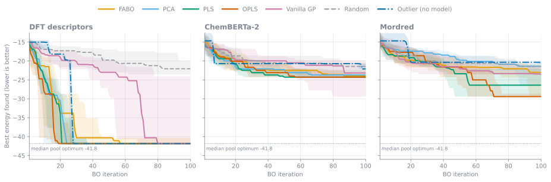
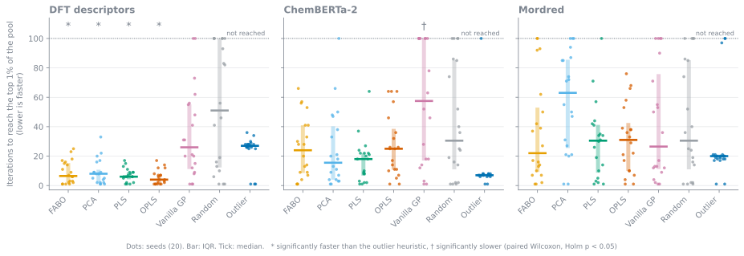
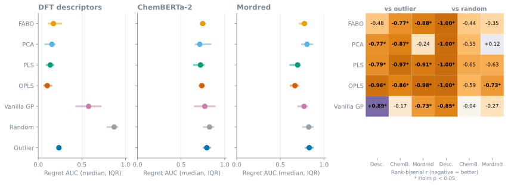
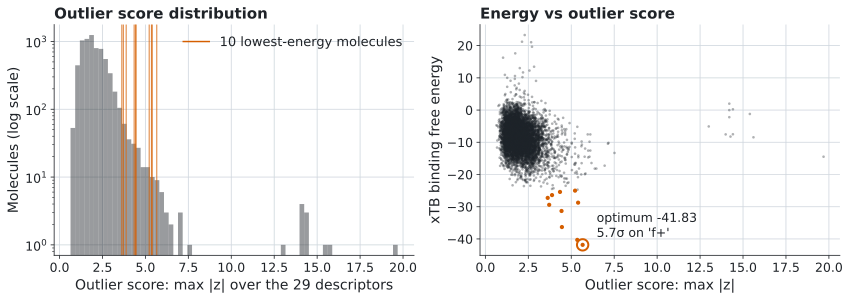
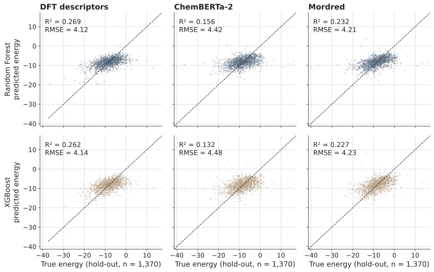

<p align="center">
  
</p>

<p align="center">
  
  
  
  
</p>

# Bayesian Optimization for N-heterocyclic carbene (NHC) design

Search a pool of 6,850 candidate NHC molecules for the one with the lowest DFT binding free energy while evaluating as few molecules as possible, and test whether the molecular representation and feature selection help. Five Bayesian-optimization (BO) variants are compared against two controls on three representations over 20 seeds (420 runs).

**Orkhan Abdullayev** · Pollice Research Group (Artificial Organic Chemistry Lab), Stratingh Institute for Chemistry, University of Groningen · <https://pollicegroup.web.rug.nl/>

## Headline result

> **On DFT descriptors, a model-free "visit the most extreme molecules first" heuristic matches OPLS-guided BO** (both find the pool optimum in 20/20 seeds, final best −41.48 ± 1.26) **and reaches the optimum in more seeds than FABO, PCA and PLS (20/20 vs 16–19/20).** The surrogate still earns its keep on speed: OPLS, PLS and PCA get to good molecules much sooner than the heuristic (regret AUC, paired rank-biserial r from −0.77 to −0.96, Holm p < 0.01); FABO is not significantly faster (p = 0.19). On ChemBERTa-2 and Mordred, no method finds the optimum reliably and few differences from random search survive multiple-comparison correction.

<p align="center">
  
</p>

*Figure 1. Running best energy (median and IQR over 20 seeds). Dashed grey: random search; dash-dot blue: the outlier heuristic (no model). [PDF](plots/fig1_convergence.pdf).*

## The question

Computing a binding free energy for one molecule is expensive (DFT or xTB), so screening a whole library is rarely affordable. BO fits a cheap probabilistic surrogate to the energies seen so far and uses it to pick the next molecule to evaluate. Here the pool is a fixed set of NHC-type catalyst candidates, the target is the DFT binding free energy (minimised), and the question is how the **molecular representation** (29 to 1,469 features) and **dimensionality reduction or feature selection** change the search.

## Method overview

Each run starts from 10 random molecules, holds out 10% of the molecules as a test set (leaving a candidate pool of 6,155), and performs 100 iterations. Every seed gives the same split and initial design to every method within a representation, which is what the paired tests rely on. All settings are CLI flags (there is no config file).

| Component | Options | Where |
|---|---|---|
| Surrogate | Exact GP (BoTorch `SingleTaskGP`) with ARD kernel; the reported runs use Matern (nu = 2.5) | `src/gp_model.py`, `src/kernels/` |
| Acquisition | EI (log-EI), PI, UCB; q-EI / q-UCB for batches. Reported runs use EI | `src/acquisition.py` |
| Feature handling | `vanilla` (none), `fabo` (Spearman correlation + CV), `pca`, `pls`, `opls`; refitted on the current training set at every iteration | `src/feature_selection/`, `src/pipelines/` |
| Controls | `random` search; `outlier` heuristic: evaluate pool molecules in decreasing order of max abs z-score over all features, no model | `baselines/` |
| Supervised baselines | Random Forest, XGBoost, to gauge how learnable the target is | `ml_models/` |

Representations (files in `data/`, feature CSVs stored with Git LFS):

| Representation | File | Features |
|---|---|---|
| DFT-derived descriptors | `dft_descriptors.csv` | 29 |
| ChemBERTa-2 embeddings | `dft_chemberta2.csv` | 384 |
| Mordred descriptors | `dft_mordred.csv` | 1,469 |

Targets are in `dft_G.json` (6,850 molecules, minimum −41.8341). `xtb_*` files are included but no xTB results are reported.

## Results

Every number below is produced by [`scripts/analyze_results.py`](scripts/analyze_results.py) (full output in [`analysis/analysis_output.md`](analysis/analysis_output.md)). Per-run metrics are in [`analysis/per_run_metrics.csv`](analysis/per_run_metrics.csv).

**Metrics.** *Iterations to top 1%* is the first iteration at which the running best reaches the 1st percentile of that seed's pool energies; *iterations to optimum* is the same for the pool optimum. Both are censored at 100 (the median and the number of seeds that reached the level are reported). *Regret AUC* is the mean over the 100 iterations of (best − pool optimum) / (initial best − pool optimum), clipped to [0, 1]: 0 means optimal from the start, 1 means no improvement over the initial design. **Paired tests** compare each BO method with `random` and with `outlier` by seed (two-sided Wilcoxon signed-rank, 20 pairs, Holm correction within each metric and reference over 3 representations × 5 methods); r is the matched-pairs rank-biserial correlation, where −1 means the method is better in every pair.

### Summary by representation

Final best energy is mean ± sd over 20 seeds; "hit optimum" counts seeds whose final best equals that seed's pool optimum (−41.83 to −36.31 on descriptors, −41.83 to −40.29 on the others).

**DFT descriptors**

| Method | Final best | Hit optimum | Iter. to optimum (median) | Iter. to top 1% (median [IQR]) | Regret AUC (median) |
|---|---|---|---|---|---|
| OPLS | −41.48 ± 1.26 | 20/20 | 16 | 4.0 [1–7] | 0.103 |
| PLS | −41.03 ± 2.60 | 19/20 | 21 | 6.0 [4–9] | 0.138 |
| PCA | −40.94 ± 2.98 | 19/20 | 23 | 8.0 [2–11] | 0.156 |
| FABO | −41.17 ± 1.33 | 16/20 | 41 | 6.5 [2–15] | 0.174 |
| Vanilla GP | −35.11 ± 9.91 | 14/20 | 77 | 26.0 [11–55] | 0.577 |
| Outlier (no model) | −41.48 ± 1.26 | 20/20 | 28 | 27.0 [26–28] | 0.237 |
| Random | −22.71 ± 4.59 | 0/20 | 100 | 51.0 [12–100] | 0.870 |

**ChemBERTa-2**

| Method | Final best | Hit optimum | Iter. to optimum (median) | Iter. to top 1% (median [IQR]) | Regret AUC (median) |
|---|---|---|---|---|---|
| FABO | −23.36 ± 1.16 | 0/20 | 100 | 24.0 [8–41] | 0.748 |
| PCA | −23.53 ± 1.88 | 0/20 | 100 | 15.5 [4–40] | 0.713 |
| PLS | −25.34 ± 3.80 | 0/20 | 100 | 18.0 [7–22] | 0.722 |
| OPLS | −24.83 ± 3.78 | 0/20 | 100 | 25.0 [11–38] | 0.737 |
| Vanilla GP | −25.42 ± 8.31 | 3/20 | 100 | 57.5 [17–100] | 0.771 |
| Outlier (no model) | −21.59 ± 0.86 | 0/20 | 100 | 7.0 [7–8] | 0.794 |
| Random | −22.30 ± 4.94 | 0/20 | 100 | 30.5 [11–85] | 0.826 |

**Mordred**

| Method | Final best | Hit optimum | Iter. to optimum (median) | Iter. to top 1% (median [IQR]) | Regret AUC (median) |
|---|---|---|---|---|---|
| FABO | −24.51 ± 4.62 | 0/20 | 100 | 22.0 [9–53] | 0.776 |
| PCA | −23.19 ± 5.33 | 1/20 | 100 | 63.0 [26–86] | 0.806 |
| PLS | −27.33 ± 6.03 | 2/20 | 100 | 30.5 [9–41] | 0.698 |
| OPLS | −30.09 ± 5.39 | 2/20 | 100 | 31.0 [10–42] | 0.667 |
| Vanilla GP (pruned, see Limitations) | −26.21 ± 8.17 | 4/20 | 100 | 26.5 [11–76] | 0.772 |
| Outlier (no model) | −20.23 ± 1.01 | 0/20 | 100 | 20.0 [18–21] | 0.831 |
| Random | −22.30 ± 4.94 | 0/20 | 100 | 30.5 [11–85] | 0.826 |

### How fast each method reaches good molecules

<p align="center">
  
</p>

*Figure 2. Iterations to the top 1% of each seed's pool. Seeds that never get there sit on the "not reached" line. \* significantly faster, † significantly slower than the outlier heuristic (Holm p < 0.05). [PDF](plots/fig2_iterations_to_top1.pdf).*

- **Descriptors:** FABO, PCA, PLS and OPLS reach the top 1% faster than the outlier heuristic in 16–17 of 20 seeds (median saving 15 to 22 iterations, Holm p = 0.0043 each), and faster than random search (p = 0.004 to 0.010, median saving 36.5 to 47 iterations). Vanilla GP is not distinguishable from either (p = 0.62 and 0.84).
- **ChemBERTa-2:** the outlier heuristic reaches the top 1% quickly (median 7 iterations), significantly faster than vanilla GP (Holm p = 0.0043) and borderline against PCA and OPLS (p = 0.052), but then stalls at a final best of −21.59 ± 0.86.
- **Mordred:** no difference from the heuristic or from random search survives correction.

### Overall search quality (regret AUC)

<p align="center">
  
</p>

*Figure 3. Left: median regret AUC with IQR (lower is better). Right: paired rank-biserial r of each BO method against the outlier heuristic and against random search; \* Holm p < 0.05. [PDF](plots/fig3_regret_auc.pdf).*

- **Descriptors:** all five BO methods beat random search (r = −1.00 for FABO, PCA, PLS, OPLS, Holm p = 2.9e-5; r = −0.85 for vanilla GP, p = 0.0036). Against the outlier heuristic, OPLS (r = −0.96, p = 1.7e-4), PLS (−0.79, p = 0.0071) and PCA (−0.77, p = 0.0086) are better, FABO is not significantly different (−0.48, p = 0.19) and vanilla GP is worse (+0.89, p = 0.0015).
- **ChemBERTa-2:** none of the BO methods beats random search after correction (best: PLS, r = −0.65, p = 0.085). Four of them beat the heuristic on regret AUC, but that heuristic is itself a weak baseline here.
- **Mordred:** only OPLS beats random search (r = −0.73, p = 0.027).

### Why the outlier heuristic works on descriptors

<p align="center">
  
</p>

*Figure 4. Left: distribution of the outlier score (max |z| over the 29 descriptors) with the ten lowest-energy molecules marked. Right: DFT energy against outlier score; the pool optimum is circled. [PDF](plots/fig4_descriptor_outliers.pdf).*

- The global optimum (−41.8341) has outlier score 5.7σ, on the `f+` column, and is the 30th most extreme of 6,850 molecules. **`f+` is one of the suspect collinear columns discussed under Limitations, so the exact score should be read with care.**
- The ten lowest-energy molecules all rank within the top 229 by outlier score (ranks 30, 39, 43, 48, 96, 106, 113, 170, 204, 229).
- The heuristic reaches the pool optimum at a median of 28 iterations, i.e. within the top 0.45% of the 6,155-molecule pool by outlier score.
- Over all molecules, outlier score and energy are only weakly rank-correlated (Spearman −0.226). The heuristic works because the best molecules sit in the tail of descriptor space, not because the score predicts energy globally.
- On ChemBERTa-2 and Mordred the ranking is uninformative about energy: it reaches the top 1% early but never gets past a final best of about −21.

## Limitations

- **Collinear descriptor columns.** The NMR, `f+`, `f-` and `fdual` columns of `dft_descriptors.csv` are almost perfectly collinear (|r| > 0.9999), probably an export error. The data are unchanged. The outlier score on descriptors can be dominated by these columns (the optimum's 5.7σ is on `f+`).
- **Vanilla GP on Mordred is pruned.** To make a plain GP tractable on the 1,469 Mordred columns, those runs use `--prune-correlated 0.95`, which keeps 523 of 1,469 columns. Vanilla results on Mordred are therefore not a plain full-feature baseline.
- **The surrogate targets are hard to learn.** Hold-out R² of Random Forest and XGBoost is only 0.13 to 0.27. This is genuine, not a bug: the energies have a long left tail that the models do not predict (parity plot below).
- **Representations are not paired by molecule order.** `dft_descriptors.csv` lists the molecules in a different row order from the ChemBERTa-2 and Mordred files, so the same seed draws different molecules on descriptors. Random-search histories on ChemBERTa-2 and Mordred are identical (SMILES and energies, 20/20 seeds) because those two files share row order; they differ from the descriptor histories (0/20 seeds). Comparisons across representations are therefore not paired by molecule.
- **Top 1% is relative to the pool.** The threshold (about −20) is the 1st percentile of each seed's pool, rebuilt in `scripts/analyze_results.py` with the same two `train_test_split` calls as `baselines/random_search.py` and checked against `best_pool_min` in all 420 histories. Iteration counts are censored at 100.
- **Single target, single kernel.** All runs use the DFT target with Matern + EI; xTB data are not analysed.

| Representation | Model | Hold-out RMSE | Hold-out R² |
|---|---|---|---|
| DFT descriptors | Random Forest | 4.12 | 0.269 |
| DFT descriptors | XGBoost | 4.14 | 0.262 |
| ChemBERTa-2 | Random Forest | 4.42 | 0.156 |
| ChemBERTa-2 | XGBoost | 4.48 | 0.132 |
| Mordred | Random Forest | 4.21 | 0.232 |
| Mordred | XGBoost | 4.23 | 0.227 |

<p align="center">
  
</p>

*Hold-out set, n = 1,370 per panel. [PDF](ml_plots/ml_parity.pdf).*

## Reproduction

### Install

```bash
git clone https://github.com/0rkhann/BO_project.git
cd BO_project
git lfs pull                      # feature CSVs are stored with Git LFS
python -m venv .bo_project_env
source .bo_project_env/bin/activate
pip install -r requirements.txt
```

### One run (dataset, method, seed)

Set `DATASET` (`dft_descriptors`, `dft_chemberta2` or `dft_mordred`), `METHOD` (`vanilla`, `fabo`, `pca`, `pls`, `opls`, `random`, `outlier`) and `SEED`:

```bash
# BO methods (vanilla, fabo, pca, pls, opls)
python -m src.cli --mode "$METHOD" \
  --input "data/$DATASET.csv" --cache data/dft_G.json \
  --output-dir "results/$DATASET/${METHOD}_Matern_EI/seed$SEED" \
  --n-initial 10 --n-iter 100 --seed "$SEED" \
  --kernels Matern --acquisitions EI

# model-free controls (random, outlier): histories go to results/${DATASET}_{random,outlier}_search/seed$SEED/
python -m src.cli --mode "$METHOD" \
  --input "data/$DATASET.csv" --cache data/dft_G.json \
  --output-dir results --n-initial 10 --n-iter 100 --seed "$SEED"
```

`--mode` selects the method. The package also installs a `bo-optimize` command via `setup.py`. Feature-selection defaults: FABO and PCA choose their size adaptively (`--fabo-k`, `--fabo-threshold`, `--pca-n-components` override it); OPLS searches 1 to 10 predictive and 1 to 3 orthogonal components (`--opls-n-components`, `--opls-orthogonal`; `--no-opls-scale` disables standardisation). X is MinMax-scaled once on train, pool and test (no targets involved).

`--prune-correlated THRESHOLD` (default off) drops constant columns, then greedily drops columns so that no kept pair has |Pearson r| > THRESHOLD (columns visited in original order). It uses X only, logs `pruned N -> M columns` and writes the kept names to `pruned_columns.txt`. The model-free controls ignore it. The reported vanilla Mordred runs use `--prune-correlated 0.95`.

### The full experiment grid

The **Rerun experiments** GitHub Actions workflow (`.github/workflows/rerun-experiments.yml`, manual `workflow_dispatch`) runs the whole matrix and commits the histories to a new branch. Defaults: all three datasets, `fabo pca pls opls vanilla random outlier`, seeds 42 to 61, 100 iterations, `results/` replaced. The workflow does the vanilla Mordred pruning for you. The 420 histories in `results/` come from run [36920300898](https://github.com/0rkhann/BO_project/actions/runs/36920300898).

`run_all_dft_experiments.sh` (local) and `submit_all_experiments.sh` (SLURM array job) are older drivers; the local one covers FABO, PLS, PCA and OPLS with seeds 42 to 46 only. `train_all_ml_models.sh` trains the Random Forest and XGBoost baselines.

### Numbers, figures and tests

```bash
python scripts/analyze_results.py      # analysis/*.csv, tables, paired tests (prints Markdown)
python plotting/make_figures.py        # plots/*.svg|pdf and ml_plots/ml_parity.svg|pdf
python scripts/summarize_results.py    # earlier mean ± sd summary
pytest                                 # tests
```

## Repository structure

```
.
├── assets/hero.svg              # README banner
├── analysis/                    # per-run metrics, summary, paired tests, full analysis output
├── baselines/                   # random-search and outlier-heuristic controls
├── data/                        # DFT and xTB targets + feature CSVs (LFS)
├── src/
│   ├── cli.py                   # entry point (bo-optimize / python -m src.cli)
│   ├── gp_model.py, kernels/    # GP surrogate and kernels
│   ├── acquisition.py           # acquisition functions
│   ├── feature_selection/       # FABO, PCA, PLS, OPLS, vanilla
│   └── pipelines/               # one BO pipeline per method
├── ml_models/                   # RF / XGBoost training
├── plotting/make_figures.py     # all README figures
├── scripts/                     # analyze_results.py, summarize_results.py, holdout metrics, cache helpers
├── results/                     # BO and control histories (CSV), 420 runs
├── ml_results/                  # supervised baseline predictions
├── plots/, ml_plots/            # figures (SVG for the README, PDF for slides)
├── tests/                       # pytest suite
└── .github/workflows/           # Rerun experiments workflow
```

## Credit and citation

This repository is the work of **Orkhan Abdullayev** at the [Pollice Research Group](https://pollicegroup.web.rug.nl/) (Artificial Organic Chemistry Lab), Stratingh Institute for Chemistry, University of Groningen. If you use it, please cite:

```
Abdullayev, O. Bayesian Optimization for Molecular Property Optimization.
Pollice Research Group, University of Groningen.
GitHub repository: https://github.com/0rkhann/BO_project
```

Built on [BoTorch](https://botorch.org/), [GPyTorch](https://gpytorch.ai/), PyTorch and scikit-learn. Released under the [MIT License](LICENSE).
